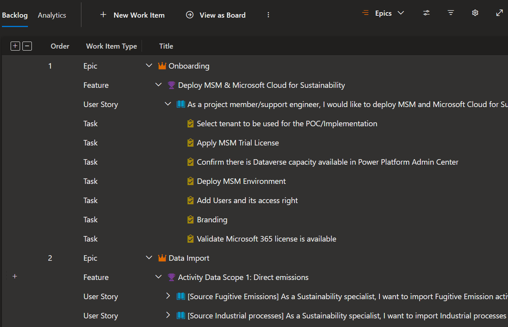
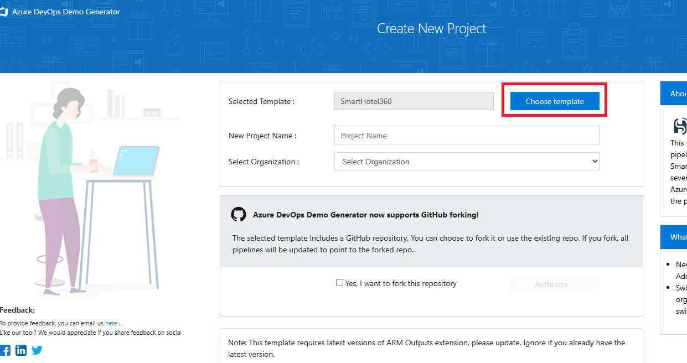
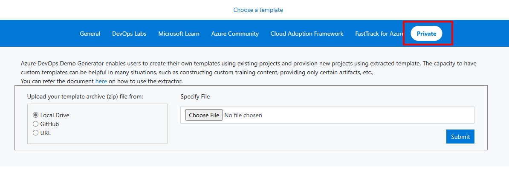
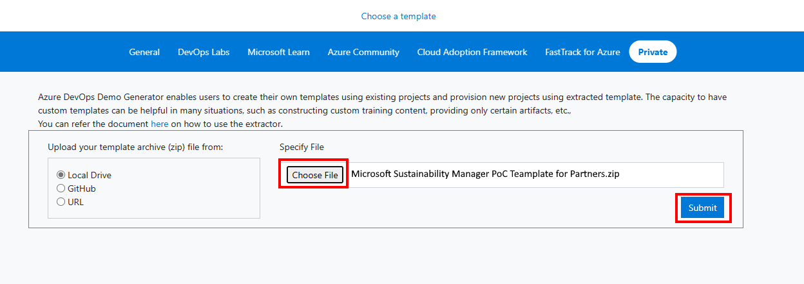
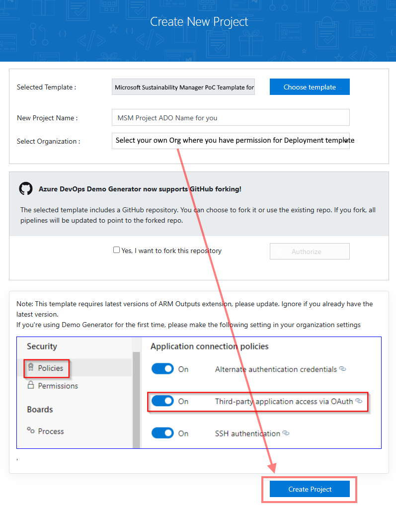
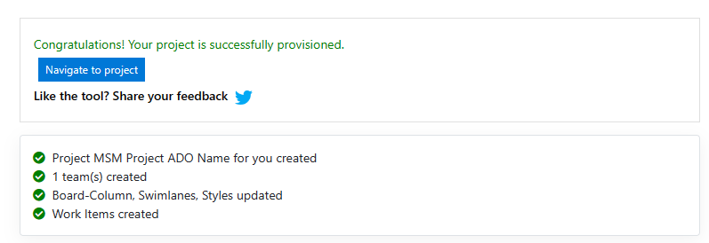
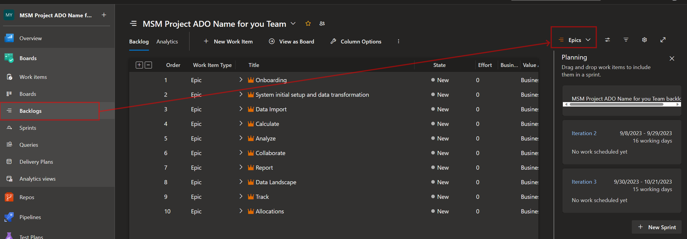

# [Private] Microsoft Sustainability Manager Project Process Template for Partners

Welcome to the Microsoft Sustainability Manager Proof of Concept (PoC) Template for Azure DevOps. This template is your essential companion for simplifying the setup process of a Microsoft Sustainability Manager (MSM) PoC, ensuring that you have all the resources and information you need at your fingertips.

## Introduction

In a world increasingly focused on sustainability and environmental responsibility, Microsoft Sustainability Manager (MSM) stands as a potent solution for managing and enhancing sustainability initiatives. This PoC template serves as your comprehensive guide and deployment framework for MSM, making it accessible to a wide array of users, including government bodies, businesses, and Microsoft's internal teams.

**Why Use This Template?**

- **Efficiency**: Our template leverages insights and best practices from numerous customer engagement projects, allowing you to set up your MSM PoC efficiently without reinventing the wheel.

- **Standardization**: By following this template, you ensure that your PoC adheres to standardized processes and configurations, enhancing consistency and comparability across projects.

- **Seamless Deployment**: We provide detailed, step-by-step instructions for deploying the template via the Azure DevOps Demo Generator, reducing deployment complexities.

- **Holistic Approach**: This template guides you through every step of the MSM PoC process, from initial onboarding to configuring Azure environments, defining business goals, and fostering collaborations.

With this template, our goal is to empower organizations and individuals to explore the potential of Microsoft Sustainability Manager, drive positive environmental impact, and contribute to a more sustainable future.

## Getting Started

### Prerequisites

Before deploying the template, ensure you have the following prerequisites in place:

#### Azure DevOps Account

You should have an Azure DevOps account to deploy this template. If you don't have one, you can [sign up here](https://learn.microsoft.com/en-us/azure/devops/user-guide/sign-up-invite-teammates?view=azure-devops).

#### Azure DevOps Demo Generator Access

You'll need access to the [Azure DevOps Demo Generator site](https://azuredevopsdemogenerator.azurewebsites.net/) to deploy this template.

### Deployment

Follow these clear, step-by-step instructions to deploy the template:

1. **Download the Template Zip file**:
   - Begin by downloading the [Microsoft Sustainability Manager PoC Teamplate for Partners.zip](./bin/Microsoft Sustainability Manager PoC Teamplate for Partners.zip) to your local machine
   

3. **Access the Azure DevOps Demo Generator**:
   - Visit the [Azure DevOps Demo Generator site](https://azuredevopsdemogenerator.azurewebsites.net/).

4. **Deploy the ADO Project with the Downloaded MSM PoC Template file**:
   - On the [Demo Generator site](https://azuredevopsdemogenerator.azurewebsites.net/), sign in using your Microsoft company credentials.
   - Click the **Choose template** button.
   
   - Select "Private" from the menu at the top.
   
   - Press the **Choose File** button, select the downloaded MSM PoC Template file, and then click the **Submit** button.  
   
   - Update your project name and select the organization where your ADO project will be deployed. Then, click **Create Project**.  
   **You should have the project deployment permission for deplying the ADO template**
   
   - After a few minutes, your ADO project will be successfully provisioned, as shown below.
   

5. **Verify the Provisioned Project**:
   - Once the project provisioning is complete, verify that the resources and configurations have been set up correctly in your Azure DevOps project by clicking **Navigate to project**.
   Navigate to your ADO project, select **Backlogs** from the left menu under **Boards**, and set the backlog filter by **Epics**.
   

6. **Good luck with your project using this template!**

We hope you find this guide friendly and straightforward as you embark on your journey with the Microsoft Sustainability Manager Proof of Concept template for Azure DevOps.
## Contributing

This project welcomes contributions and suggestions.  Most contributions require you to agree to a
Contributor License Agreement (CLA) declaring that you have the right to, and actually do, grant us
the rights to use your contribution. For details, visit https://cla.opensource.microsoft.com.

When you submit a pull request, a CLA bot will automatically determine whether you need to provide
a CLA and decorate the PR appropriately (e.g., status check, comment). Simply follow the instructions
provided by the bot. You will only need to do this once across all repos using our CLA.

This project has adopted the [Microsoft Open Source Code of Conduct](https://opensource.microsoft.com/codeofconduct/).
For more information see the [Code of Conduct FAQ](https://opensource.microsoft.com/codeofconduct/faq/) or
contact [opencode@microsoft.com](mailto:opencode@microsoft.com) with any additional questions or comments.

## Trademarks

This project may contain trademarks or logos for projects, products, or services. Authorized use of Microsoft 
trademarks or logos is subject to and must follow 
[Microsoft's Trademark & Brand Guidelines](https://www.microsoft.com/en-us/legal/intellectualproperty/trademarks/usage/general).
Use of Microsoft trademarks or logos in modified versions of this project must not cause confusion or imply Microsoft sponsorship.
Any use of third-party trademarks or logos are subject to those third-party's policies.
